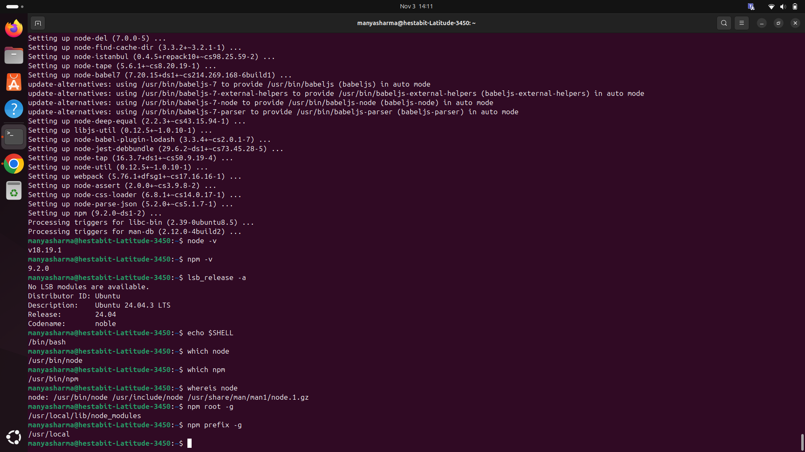
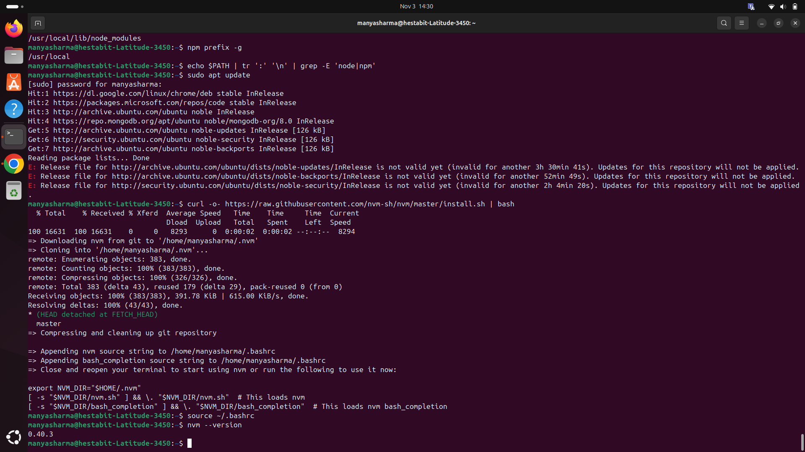
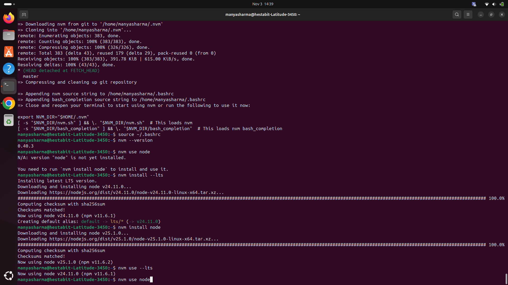
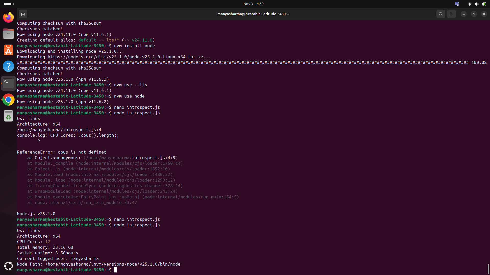

<!-- 📄 WEEK 1 — ENGINEERING MINDSET BOOTCAMP -->

<!-- DAY 1 — SYSTEM REVERSE ENGINEERING + NODE & TERMINAL MASTERING -->

<!-- 1. Identify and document: -->

OS Version:
    command used: lsb_release -a
    output: 
        Distributor ID: Ubuntu
        Description: Ubuntu 24.04.3 LTS
        Release: 24.04
        Codename: noble

    
Current Shell:
    command used: echo $SHELL
    output:
        /bin/bash

    
Node Binary Path:
    command used: which node
    output:
        /usr/bin/node
    
    command used: which npm
    output:
        /usr/bin/npm

    command used: whereis node
    output:
        node: /usr/bin/node /usr/include/node /usr/share/man/man1/node.1.gz

NPM Global Installation:
    command used: npm root -g
    output:
        /usr/local/lib/node_modules

    command used: npm prefix 
    output:
        usr/local

All Path Entries that include "node" or "npm":
    command used: echo $PATH | tr ':' '\n' | grep -E 'node|npm'
    output:
        Nothing appears, reason- If this command do not give output it means no explicit "node" or "npm" folders are found but Node.js can still work if installed in default system directories.

    

<!-- 2. Install & use NVM (Node Version Manager: -->

Install NVM:
    command used: curl -o- https://raw.githubusercontent.com/nvm/master/install.sh | bash

Switch Node from LTS → Latest and back:
    commands used:
        nvm install --lts
        nvm install node
        nvm use --lts
        nvm use node

